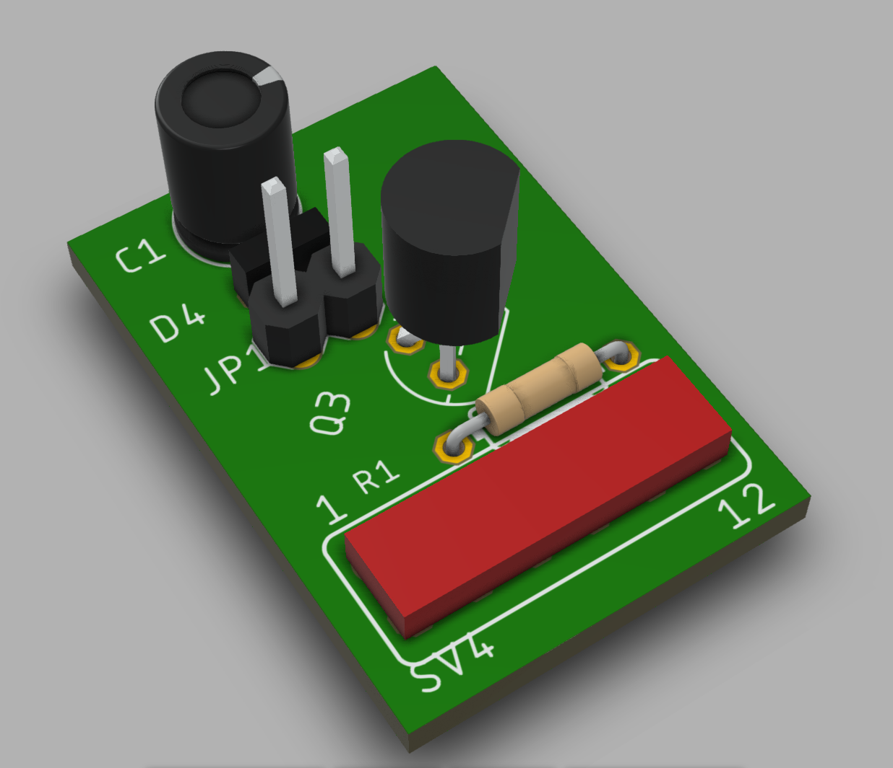

# Raspberry Pi 4 fan controller

Raspberry Pi 4 PID controlled cooling.

## Parts 
I purchased this [case with fans](https://www.amazon.com/Raspberry-Acrylic-Cooling-Install-Magnetic/dp/B07WTWKQKT) from local store.


By default fan is connected to +5V e.g. it is all the time on.
 

This causes continuous noise.

There are severail instructions for making temperature controlled fan where the fan speed is dependent on the CPU temperature. For example this good one: [Variable Speed Cooling Fan for Raspberry Pi using PWM ](https://www.sensorsiot.org/variable-speed-cooling-fan-for-raspberry-pi-using-pwm-video138/)

Additional requrement I had was that I want to 
- get the control logic inside the case.
- stop the fan if CPU is not too hot and make the fan as silent as possible.

Since I was not able to find good instructions for those I needed to go into DIY mode. Based on above example I made design with [Eagle](https://www.autodesk.com/products/eagle/overview). 
Parts used:
- MOSFET : 2N7000
- resistor : 100k
- capacitor : 100uF
- 12 pin female connector
- diode : skipped (even added to design)

Capacitor as well as high PWM frequency (200Hz) makes PWM output closer to DAC output. This reduces noise of the motor when it was driven with PWM. 

## HW 
Design was done with [Eagle](https://www.autodesk.com/products/eagle/free-download). Here are [board](eagle/rpifan.brd) and [schema](eagle/rpifan.sch) files.

Top view of the designed board looks like this.

.

Trick to make the assembly and soldering easier I cut legs 3,5 and 11 away from the connector. This way traces to pins 4,6,12 is easy to make.

3d visualization exported from Eagle to [Fusion360](https://www.autodesk.com/campaigns/fusion-360-for-hobbyists)



Actual assembly looks almost 1:1 the same :) 

NOTE: FET is oriented differently in the actual assembly due mistake. Some rework was required solder FET legs properly.


Fan control board inside the Case


Case did not close properly since fan on top cover goes lower than the top cover. Luckily the case is parts are put together with magnets. Problem was solved with ~2mm thick round magnets (see yellow arrows).


## SW 
Control SW was made with [Node Red](https://nodered.org/) which is pre installed on Raspbian. [Node Red Dashboard](https://flows.nodered.org/node/node-red-dashboard) must be installed.

CPU temperature reading was done with modified version of [Raspberry Pi Control Dashboard](https://flows.nodered.org/flow/25af5334a79d6c02d6413968a8bff572). 

There are separate flows for reading temperature


Controlling the FAN


and for logging (off by default)

Logging of CPU temperature, CPU load and fan PWM is for later analysis of the functionality. There is also Node Red Dashboard GUI showing CPU tepmerature, PID output and PID internal paramters. It could help to tune PID parameters.


All flows are [here](flow/flow.json)

The code in PID controller node is following:
```js
setPoint = 60 // Target temperature
p = 2         // Proportional
i = 0.5       // Integral
d = 0.1       // Derivative
integral=context.get('integral') || 0 
lastTemperature = context.get('last') || setPoint

temperature = msg.payload
error = setPoint - temperature
proportional = p * error
integral = integral + i * error

// Limits for integral value
if (integral<-100){
    integral=-100
} 
if (integral > 100){
    integral = 100
}

dtemp = temperature - lastTemperature

derivative = d * dtemp

context.set('last',temperature)
context.set('integral',integral)

output = proportional + integral + derivative

// Limits for output value. 
// FAN can only reduce temperature
if (output<0){
    output=0
} else if (output > 100){
    output = 100
}

msg.payload = 100-output

return [msg, 
    {"payload": integral},
    {"payload": derivative}
]
```
Target temperature (`setPoint`) is set to 60 &deg;C so fan is not running if CPU load is low.

Attention can be paid also to "pid to pwn" node where 0-100 PID output is scaled to suitable PWM duty cycle. My fan started reliably with 50% duty cycle so PID output was changed from 0-100 to 0,50-100.


